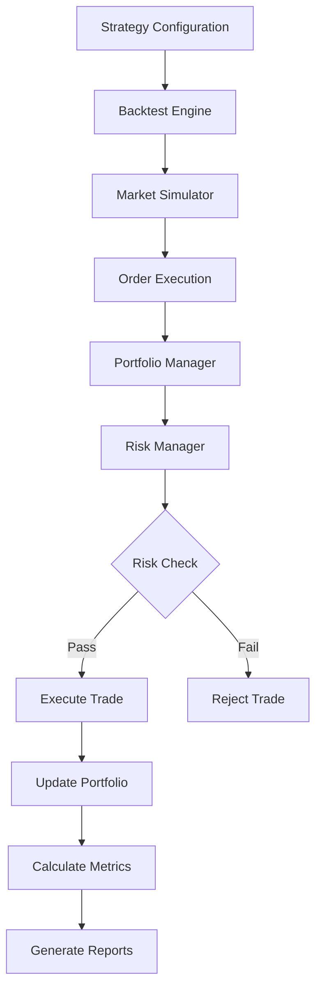

## .kiro/specs/backtesting-framework/design.md
```markdown
# Backtesting Framework Design
---
priority: 1
---

## Architecture Overview



## Core Components Design

### Backtest Engine
```python
class BacktestEngine:
    """Main backtesting orchestrator"""
    
    def __init__(self, config: BacktestConfig):
        self.config = config
        self.strategy = Strategy(config.strategy_params)
        self.portfolio = Portfolio(config.initial_capital)
        self.market_sim = MarketSimulator(config.market_params)
        self.risk_manager = RiskManager(config.risk_params)
        self.metrics_tracker = MetricsTracker()
        
    def run(self, predictions: pd.DataFrame, market_data: pd.DataFrame):
        """Run complete backtest"""
        results = []
        
        for date in market_data.index:
            # Get predictions for date
            daily_predictions = predictions.loc[date]
            
            # Generate signals
            signals = self.strategy.generate_signals(
                daily_predictions,
                self.portfolio.positions,
                market_data.loc[:date]
            )
            
            # Risk checks
            approved_signals = self.risk_manager.filter_signals(
                signals,
                self.portfolio,
                market_data.loc[date]
            )
            
            # Execute trades
            executed_trades = self.market_sim.execute_orders(
                approved_signals,
                market_data.loc[date],
                self.portfolio
            )
            
            # Update portfolio
            self.portfolio.update(executed_trades, market_data.loc[date])
            
            # Track metrics
            self.metrics_tracker.update(self.portfolio, date)
            
            results.append({
                'date': date,
                'portfolio_value': self.portfolio.total_value,
                'positions': self.portfolio.positions.copy(),
                'trades': executed_trades
            })
        
        return self.generate_report(results)
```

### Trading Strategy
```python
class Strategy:
    """Trading strategy implementation"""
    
    def generate_signals(self, predictions, positions, historical_data):
        """Generate trading signals from predictions"""
        signals = []
        
        for ticker, prediction in predictions.items():
            # Check entry conditions
            if self.should_enter(ticker, prediction, positions):
                signal = self.create_entry_signal(ticker, prediction)
                signals.append(signal)
            
            # Check exit conditions
            elif ticker in positions:
                if self.should_exit(ticker, positions[ticker], prediction):
                    signal = self.create_exit_signal(ticker, positions[ticker])
                    signals.append(signal)
        
        return signals
    
    def should_enter(self, ticker, prediction, positions):
        """Determine if should enter position"""
        # Check if already in position
        if ticker in positions:
            return False
        
        # Check prediction threshold
        expected_return = prediction['return_5d']
        if expected_return < self.config.min_expected_return:
            return False
        
        # Check confidence threshold
        confidence = prediction['confidence']
        if confidence < self.config.min_confidence:
            return False
        
        # Check portfolio limits
        if len(positions) >= self.config.max_positions:
            return False
        
        return True
    
    def should_exit(self, ticker, position, prediction):
        """Determine if should exit position"""
        # Check stop loss
        if position.unrealized_pnl_pct <= -self.config.stop_loss:
            return True
        
        # Check profit target
        if position.unrealized_pnl_pct >= self.config.profit_target:
            return True
        
        # Check time stop
        if position.days_held >= self.config.time_stop:
            return True
        
        # Check prediction reversal
        if prediction['return_5d'] < -self.config.exit_threshold:
            return True
        
        return False
```

### Portfolio Management
```python
class Portfolio:
    """Portfolio state and management"""
    
    def __init__(self, initial_capital):
        self.cash = initial_capital
        self.positions = {}
        self.history = []
        self.initial_capital = initial_capital
        
    def update(self, trades, market_prices):
        """Update portfolio with executed trades"""
        for trade in trades:
            if trade.type == 'BUY':
                self.open_position(trade, market_prices)
            elif trade.type == 'SELL':
                self.close_position(trade, market_prices)
        
        # Update position values
        self.mark_to_market(market_prices)
        
        # Record state
        self.history.append(self.get_snapshot())
    
    def open_position(self, trade, market_prices):
        """Open new position"""
        position = Position(
            ticker=trade.ticker,
            entry_price=trade.execution_price,
            shares=trade.shares,
            entry_date=trade.timestamp,
            commission=trade.commission
        )
        
        self.positions[trade.ticker] = position
        self.cash -= trade.total_cost
    
    def close_position(self, trade, market_prices):
        """Close existing position"""
        position = self.positions[trade.ticker]
        
        # Calculate P&L
        pnl = (trade.execution_price - position.entry_price) * position.shares
        pnl -= trade.commission  # Subtract exit commission
        
        self.cash += trade.execution_price * position.shares - trade.commission
        
        # Record closed position
        position.exit_price = trade.execution_price
        position.exit_date = trade.timestamp
        position.realized_pnl = pnl
        
        del self.positions[trade.ticker]
    
    @property
    def total_value(self):
        """Calculate total portfolio value"""
        positions_value = sum(p.current_value for p in self.positions.values())
        return self.cash + positions_value
    
    @property
    def returns(self):
        """Calculate portfolio returns"""
        return (self.total_value - self.initial_capital) / self.initial_capital
```

### Market Simulator
```python
class MarketSimulator:
    """Simulates market execution"""
    
    def __init__(self, cost_model):
        self.cost_model = cost_model
        
    def execute_orders(self, signals, market_data, portfolio):
        """Execute orders with realistic costs"""
        executed_trades = []
        
        for signal in signals:
            # Calculate execution price with slippage
            execution_price = self.calculate_execution_price(
                signal,
                market_data[signal.ticker]
            )
            
            # Calculate transaction costs
            costs = self.calculate_costs(signal, execution_price)
            
            # Check if enough capital
            if signal.type == 'BUY':
                required_capital = execution_price * signal.shares + costs['total']
                if required_capital > portfolio.cash:
                    continue  # Skip if insufficient funds
            
            # Create executed trade
            trade = ExecutedTrade(
                ticker=signal.ticker,
                type=signal.type,
                shares=signal.shares,
                execution_price=execution_price,
                commission=costs['commission'],
                slippage=costs['slippage'],
                spread_cost=costs['spread'],
                timestamp=market_data.index[0]
            )
            
            executed_trades.append(trade)
        
        return executed_trades
    
    def calculate_execution_price(self, signal, market_data):
        """Calculate execution price with slippage"""
        mid_price = (market_data['high'] + market_data['low']) / 2
        
        # Base slippage
        slippage_pct = self.cost_model.slippage['base']
        
        # Volatility adjustment
        volatility = market_data['volatility']
        slippage_pct += volatility * self.cost_model.slippage['volatility_factor']
        
        # Size impact
        market_cap = market_data.get('market_cap', 1e9)
        trade_value = signal.shares * mid_price
        size_impact = (trade_value / market_cap) * self.cost_model.slippage['size_impact']
        slippage_pct += size_impact
        
        # Apply slippage (worse price for buyer)
        if signal.type == 'BUY':
            execution_price = mid_price * (1 + slippage_pct)
        else:
            execution_price = mid_price * (1 - slippage_pct)
        
        return execution_price
```

### Risk Management
```python
class RiskManager:
    """Risk management and position sizing"""
    
    def __init__(self, config):
        self.config = config
        
    def filter_signals(self, signals, portfolio, market_data):
        """Filter signals based on risk rules"""
        approved = []
        
        for signal in signals:
            # Size position based on Kelly criterion
            signal.shares = self.calculate_position_size(
                signal,
                portfolio,
                market_data
            )
            
            # Check risk limits
            if self.check_risk_limits(signal, portfolio, market_data):
                approved.append(signal)
        
        return approved
    
    def calculate_position_size(self, signal, portfolio, market_data):
        """Calculate optimal position size"""
        # Kelly criterion
        win_prob = signal.confidence
        win_loss_ratio = signal.expected_return / self.config.stop_loss
        kelly_fraction = (win_prob * win_loss_ratio - (1 - win_prob)) / win_loss_ratio
        
        # Apply Kelly fraction with safety factor
        kelly_fraction = max(0, min(kelly_fraction * 0.25, 0.1))  # Cap at 10%
        
        # Calculate shares
        position_value = portfolio.total_value * kelly_fraction
        share_price = market_data[signal.ticker]['close']
        shares = int(position_value / share_price)
        
        return shares
    
    def check_risk_limits(self, signal, portfolio, market_data):
        """Check if signal passes risk limits"""
        # Portfolio risk limit
        current_risk = self.calculate_portfolio_risk(portfolio, market_data)
        if current_risk > self.config.max_portfolio_risk:
            return False
        
        # Correlation limit
        if signal.ticker in portfolio.positions:
            correlations = self.calculate_correlations(
                signal.ticker,
                portfolio.positions.keys(),
                market_data
            )
            if max(correlations.values()) > self.config.max_correlation:
                return False
        
        # Sector exposure limit
        sector = market_data[signal.ticker].get('sector')
        sector_exposure = self.calculate_sector_exposure(portfolio, sector)
        if sector_exposure > self.config.max_sector_exposure:
            return False
        
        return True
```

### Performance Analytics
```python
class PerformanceAnalyzer:
    """Calculate performance metrics"""
    
    def calculate_metrics(self, portfolio_history):
        """Calculate all performance metrics"""
        returns = pd.Series([p['returns'] for p in portfolio_history])
        
        metrics = {
            # Returns
            'total_return': self.total_return(returns),
            'annual_return': self.annual_return(returns),
            'monthly_returns': self.monthly_returns(returns),
            
            # Risk
            'volatility': self.volatility(returns),
            'max_drawdown': self.max_drawdown(returns),
            'var_95': self.value_at_risk(returns, 0.95),
            'cvar_95': self.conditional_value_at_risk(returns, 0.95),
            
            # Risk-adjusted
            'sharpe_ratio': self.sharpe_ratio(returns),
            'sortino_ratio': self.sortino_ratio(returns),
            'calmar_ratio': self.calmar_ratio(returns),
            
            # Trading
            'win_rate': self.win_rate(portfolio_history),
            'profit_factor': self.profit_factor(portfolio_history),
            'avg_win_loss_ratio': self.avg_win_loss_ratio(portfolio_history),
            
            # Advanced
            'tail_ratio': self.tail_ratio(returns),
            'omega_ratio': self.omega_ratio(returns),
            'ulcer_index': self.ulcer_index(returns)
        }
        
        return metrics
    
    def sharpe_ratio(self, returns, risk_free_rate=0.02):
        """Calculate Sharpe ratio"""
        excess_returns = returns - risk_free_rate / 252
        return np.sqrt(252) * excess_returns.mean() / excess_returns.std()
    
    def max_drawdown(self, returns):
        """Calculate maximum drawdown"""
        cumulative = (1 + returns).cumprod()
        running_max = cumulative.expanding().max()
        drawdown = (cumulative - running_max) / running_max
        return drawdown.min()
```
```

