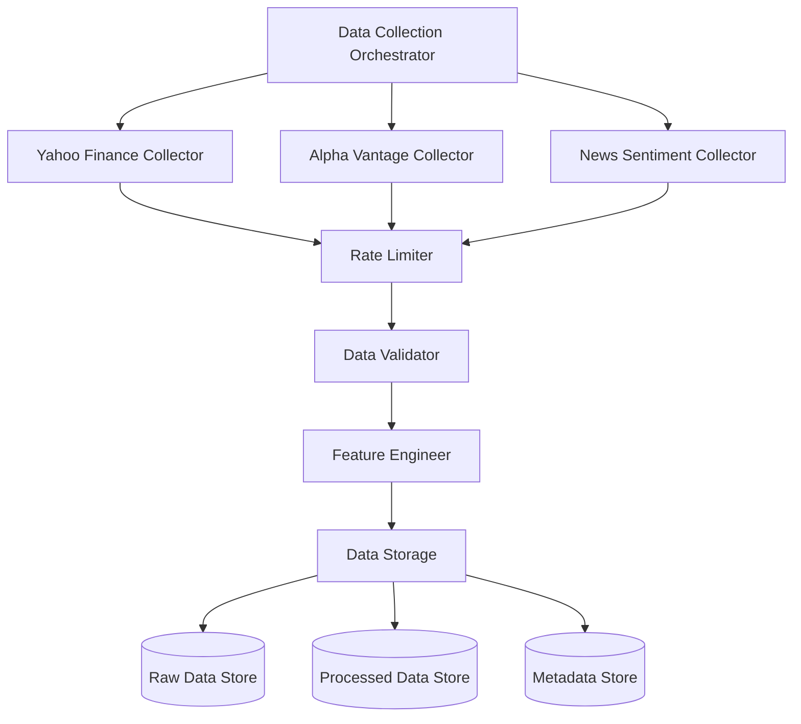

## .kiro/specs/data-collection/design.md
```markdown
# Data Collection Design
---
priority: 1
---

## Architecture Overview



## Component Design

### DataCollectionOrchestrator
```python
class DataCollectionOrchestrator:
    """Coordinates data collection from multiple sources"""
    
    def __init__(self, config: DataConfig):
        self.collectors = {
            'yahoo': YahooFinanceCollector(),
            'alpha': AlphaVantageCollector(),
            'news': NewsCollector()
        }
        self.validator = DataValidator()
        self.engineer = FeatureEngineer()
        
    async def collect_all(self, tickers: List[str]) -> Dict[str, pd.DataFrame]:
        """Collect data for all tickers"""
        tasks = [self.collect_ticker(t) for t in tickers]
        return await asyncio.gather(*tasks)
```

### Rate Limiting Design
```python
class RateLimiter:
    """Token bucket rate limiter"""
    
    def __init__(self, rate: int = 5, period: int = 1):
        self.rate = rate
        self.period = period
        self.tokens = rate
        self.last_update = time.time()
        
    async def acquire(self):
        """Acquire token for request"""
        while self.tokens <= 0:
            await self.refill()
            await asyncio.sleep(0.1)
        self.tokens -= 1
```

### Data Validation Pipeline
```python
class DataValidator:
    """Multi-stage validation pipeline"""
    
    validators = [
        SchemaValidator(),      # Check column presence
        RangeValidator(),       # Check value ranges
        ConsistencyValidator(), # Check OHLC relationships
        CompletenessValidator() # Check missing data
    ]
    
    def validate(self, data: pd.DataFrame) -> ValidationResult:
        for validator in self.validators:
            result = validator.validate(data)
            if not result.is_valid:
                return result
        return ValidationResult(is_valid=True)
```

### Feature Engineering Pipeline
```python
class FeatureEngineer:
    """Technical indicator calculation"""
    
    def engineer_features(self, data: pd.DataFrame) -> pd.DataFrame:
        # Price-based features
        data['Returns'] = data['Close'].pct_change()
        data['LogReturns'] = np.log(data['Close'] / data['Close'].shift(1))
        
        # Technical indicators
        data['RSI'] = self.calculate_rsi(data['Close'])
        data['MACD'], data['MACD_Signal'] = self.calculate_macd(data['Close'])
        
        # Volume features
        data['Volume_Ratio'] = data['Volume'] / data['Volume'].rolling(20).mean()
        
        # Volatility
        data['Volatility'] = data['Returns'].rolling(20).std()
        
        return data
```

## Data Storage Design

### Storage Layers
1. **Raw Data**: Parquet files partitioned by ticker/year
2. **Processed Data**: HDF5 with compression
3. **Metadata**: SQLite database

### Directory Structure
```
data/
├── raw/
│   └── {ticker}/
│       └── {year}.parquet
├── processed/
│   └── {ticker}/
│       └── features_{date}.h5
└── metadata/
    └── data_catalog.db
```

### Caching Strategy
```python
class DataCache:
    """LRU cache for frequently accessed data"""
    
    def __init__(self, max_size: int = 100):
        self.cache = LRUCache(max_size)
        
    def get(self, key: str) -> Optional[pd.DataFrame]:
        if key in self.cache:
            return self.cache[key]
        
        # Load from disk
        data = self.load_from_disk(key)
        if data is not None:
            self.cache[key] = data
        return data
```

## Error Recovery Design

### Retry Strategy
```python
@retry(
    stop=stop_after_attempt(5),
    wait=wait_exponential(multiplier=1, min=4, max=60),
    retry=retry_if_exception_type(requests.RequestException)
)
def download_with_retry(ticker: str) -> pd.DataFrame:
    """Download with exponential backoff"""
    return yf.download(ticker)
```

### Fallback Chain
```python
class FallbackDataCollector:
    """Fallback through multiple data sources"""
    
    def collect(self, ticker: str) -> pd.DataFrame:
        for source in self.sources:
            try:
                return source.download(ticker)
            except Exception as e:
                logger.warning(f"{source} failed: {e}")
                continue
        raise DataCollectionError(f"All sources failed for {ticker}")
```
```