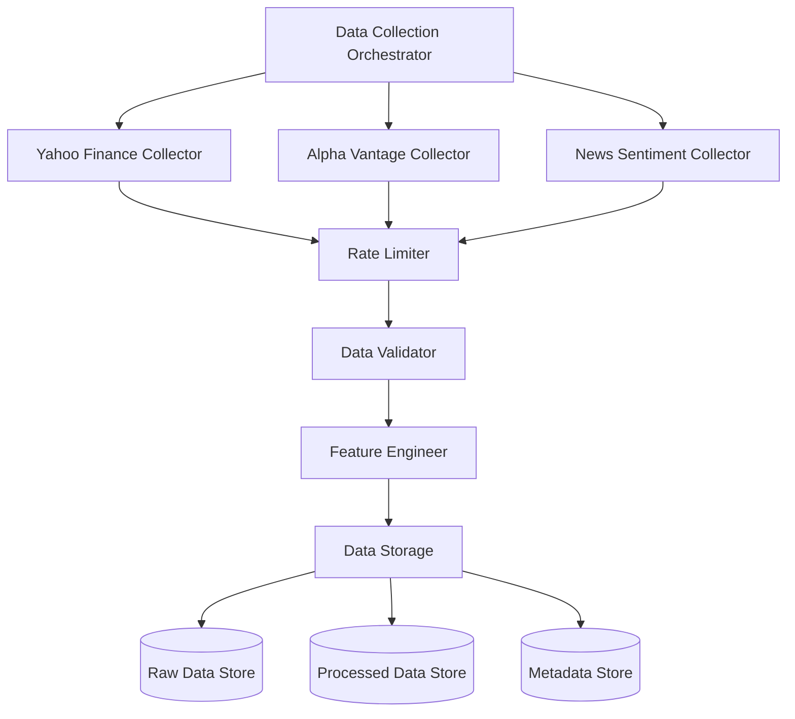

# Data Collection Specification

## .kiro/specs/data-collection/requirements.md
```markdown
# Data Collection Requirements
---
priority: 1
---

## Functional Requirements

### EARS Notation Requirements

WHEN the system initializes
THE SYSTEM SHALL download historical price data for configured tickers
WHERE the data includes OHLCV and adjusted close
IF the download fails THE SYSTEM SHALL retry with exponential backoff

WHEN collecting data for a ticker
THE SYSTEM SHALL validate minimum 252 trading days are available
IF insufficient data THE SYSTEM SHALL log warning and exclude ticker

WHEN data contains missing values
THE SYSTEM SHALL interpolate up to 5 consecutive missing values
IF more than 5 consecutive missing THE SYSTEM SHALL mark segment as invalid

WHEN new data is collected
THE SYSTEM SHALL calculate technical indicators including RSI, MACD, Bollinger Bands
WHERE calculations use standard parameters (RSI=14, MACD=12/26/9)

WHEN API rate limits are reached
THE SYSTEM SHALL pause for the required cooldown period
AND THE SYSTEM SHALL log the rate limit event

## Data Requirements

### Primary Data Sources
- **Yahoo Finance**: Primary source via yfinance
- **Alpha Vantage**: Backup source for failures
- **NewsAPI**: Sentiment data (future enhancement)

### Required Fields
```python
REQUIRED_COLUMNS = [
    'Open', 'High', 'Low', 'Close', 'Volume', 'Adj Close'
]

CALCULATED_FIELDS = [
    'Returns', 'LogReturns', 'RSI', 'MACD', 'MACD_Signal',
    'BB_Upper', 'BB_Middle', 'BB_Lower', 'Volume_Ratio'
]
```

### Data Quality Constraints
- Maximum missing data: 5% per ticker
- Minimum volume: 100,000 shares/day
- Price outliers: Flag if price change > 50% in single day
- Date coverage: Minimum 5 years historical data

### Update Frequency
- Historical data: One-time download
- Daily updates: After market close (5 PM EST)
- Real-time: Not required for initial version

## Performance Requirements

### Latency
- Initial bulk download: < 5 minutes for 10 tickers × 5 years
- Daily update: < 30 seconds per ticker
- Feature calculation: < 100ms per ticker

### Throughput
- Concurrent downloads: Maximum 5 parallel requests
- Batch processing: 100 tickers per batch
- Rate limiting: Respect provider limits (5 req/sec for yfinance)

### Storage
- Raw data: ~10MB per ticker (5 years)
- Processed data: ~50MB per ticker (with features)
- Total estimate: ~1GB for 10 tickers

## Reliability Requirements

### Error Handling
- Network failures: Exponential backoff with max 5 retries
- Invalid data: Skip ticker and log error
- API changes: Graceful degradation with fallback sources

### Data Validation
- Schema validation on every download
- Range checks for all numeric fields
- Chronological ordering verification
- Weekend/holiday filtering
```

## .kiro/specs/data-collection/design.md
```markdown
# Data Collection Design
---
priority: 1
---

## Architecture Overview



## Component Design

### DataCollectionOrchestrator
```python
class DataCollectionOrchestrator:
    """Coordinates data collection from multiple sources"""
    
    def __init__(self, config: DataConfig):
        self.collectors = {
            'yahoo': YahooFinanceCollector(),
            'alpha': AlphaVantageCollector(),
            'news': NewsCollector()
        }
        self.validator = DataValidator()
        self.engineer = FeatureEngineer()
        
    async def collect_all(self, tickers: List[str]) -> Dict[str, pd.DataFrame]:
        """Collect data for all tickers"""
        tasks = [self.collect_ticker(t) for t in tickers]
        return await asyncio.gather(*tasks)
```

### Rate Limiting Design
```python
class RateLimiter:
    """Token bucket rate limiter"""
    
    def __init__(self, rate: int = 5, period: int = 1):
        self.rate = rate
        self.period = period
        self.tokens = rate
        self.last_update = time.time()
        
    async def acquire(self):
        """Acquire token for request"""
        while self.tokens <= 0:
            await self.refill()
            await asyncio.sleep(0.1)
        self.tokens -= 1
```

### Data Validation Pipeline
```python
class DataValidator:
    """Multi-stage validation pipeline"""
    
    validators = [
        SchemaValidator(),      # Check column presence
        RangeValidator(),       # Check value ranges
        ConsistencyValidator(), # Check OHLC relationships
        CompletenessValidator() # Check missing data
    ]
    
    def validate(self, data: pd.DataFrame) -> ValidationResult:
        for validator in self.validators:
            result = validator.validate(data)
            if not result.is_valid:
                return result
        return ValidationResult(is_valid=True)
```

### Feature Engineering Pipeline
```python
class FeatureEngineer:
    """Technical indicator calculation"""
    
    def engineer_features(self, data: pd.DataFrame) -> pd.DataFrame:
        # Price-based features
        data['Returns'] = data['Close'].pct_change()
        data['LogReturns'] = np.log(data['Close'] / data['Close'].shift(1))
        
        # Technical indicators
        data['RSI'] = self.calculate_rsi(data['Close'])
        data['MACD'], data['MACD_Signal'] = self.calculate_macd(data['Close'])
        
        # Volume features
        data['Volume_Ratio'] = data['Volume'] / data['Volume'].rolling(20).mean()
        
        # Volatility
        data['Volatility'] = data['Returns'].rolling(20).std()
        
        return data
```

## Data Storage Design

### Storage Layers
1. **Raw Data**: Parquet files partitioned by ticker/year
2. **Processed Data**: HDF5 with compression
3. **Metadata**: SQLite database

### Directory Structure
```
data/
├── raw/
│   └── {ticker}/
│       └── {year}.parquet
├── processed/
│   └── {ticker}/
│       └── features_{date}.h5
└── metadata/
    └── data_catalog.db
```

### Caching Strategy
```python
class DataCache:
    """LRU cache for frequently accessed data"""
    
    def __init__(self, max_size: int = 100):
        self.cache = LRUCache(max_size)
        
    def get(self, key: str) -> Optional[pd.DataFrame]:
        if key in self.cache:
            return self.cache[key]
        
        # Load from disk
        data = self.load_from_disk(key)
        if data is not None:
            self.cache[key] = data
        return data
```

## Error Recovery Design

### Retry Strategy
```python
@retry(
    stop=stop_after_attempt(5),
    wait=wait_exponential(multiplier=1, min=4, max=60),
    retry=retry_if_exception_type(requests.RequestException)
)
def download_with_retry(ticker: str) -> pd.DataFrame:
    """Download with exponential backoff"""
    return yf.download(ticker)
```

### Fallback Chain
```python
class FallbackDataCollector:
    """Fallback through multiple data sources"""
    
    def collect(self, ticker: str) -> pd.DataFrame:
        for source in self.sources:
            try:
                return source.download(ticker)
            except Exception as e:
                logger.warning(f"{source} failed: {e}")
                continue
        raise DataCollectionError(f"All sources failed for {ticker}")
```
```

