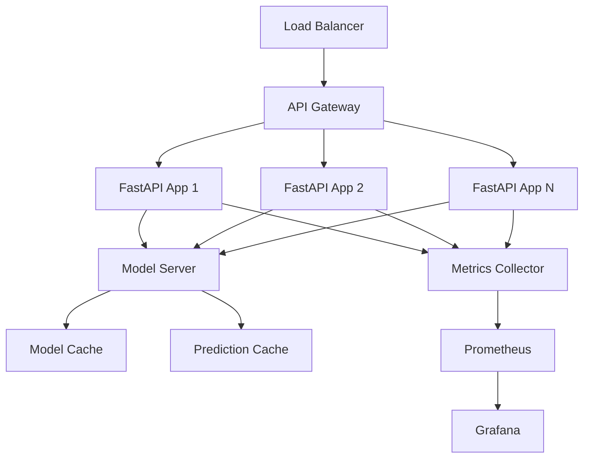

## .kiro/specs/model-serving/design.md
```markdown
# Model Serving Design
---
priority: 1
---

## Architecture Overview



## API Implementation

### FastAPI Application
```python
from fastapi import FastAPI, HTTPException, Depends
from pydantic import BaseModel, validator
import torch
import numpy as np
from typing import List, Dict, Optional

app = FastAPI(
    title="Time-Series Transformer API",
    version="1.0.0",
    docs_url="/docs"
)

class PredictionRequest(BaseModel):
    """Request schema for predictions"""
    ticker: str
    features: List[List[float]]
    horizon: Optional[int] = 5
    
    @validator('features')
    def validate_features(cls, v):
        if len(v) != 60:
            raise ValueError('Features must have 60 time steps')
        if any(len(row) != 7 for row in v):
            raise ValueError('Each time step must have 7 features')
        return v
    
    @validator('ticker')
    def validate_ticker(cls, v):
        if not v.isupper() or len(v) > 5:
            raise ValueError('Invalid ticker symbol')
        return v

class PredictionResponse(BaseModel):
    """Response schema for predictions"""
    prediction: List[float]
    confidence_intervals: Dict[str, List[float]]
    attention_weights: Optional[List[List[float]]]
    metadata: Dict

@app.post("/predict", response_model=PredictionResponse)
async def predict(
    request: PredictionRequest,
    model_server: ModelServer = Depends(get_model_server)
):
    """Generate prediction for single ticker"""
    try:
        # Check cache
        cache_key = generate_cache_key(request)
        if cached := cache.get(cache_key):
            return cached
        
        # Preprocess
        features_tensor = preprocess_features(request.features)
        
        # Inference
        with torch.no_grad():
            output = model_server.predict(
                features_tensor,
                return_attention=True
            )
        
        # Postprocess
        response = postprocess_output(output, request.ticker)
        
        # Cache result
        cache.set(cache_key, response, ttl=300)
        
        return response
        
    except Exception as e:
        logger.error(f"Prediction failed: {e}")
        raise HTTPException(status_code=500, detail=str(e))
```

### Model Server
```python
class ModelServer:
    """Manages model loading and inference"""
    
    def __init__(self, model_path: str, device: str = 'cuda'):
        self.model_path = model_path
        self.device = torch.device(device if torch.cuda.is_available() else 'cpu')
        self.model = None
        self.load_model()
        self.warm_up()
    
    def load_model(self):
        """Load model with error handling"""
        try:
            # Load TorchScript model for production
            self.model = torch.jit.load(
                self.model_path,
                map_location=self.device
            )
            self.model.eval()
            
            logger.info(f"Model loaded from {self.model_path}")
            
        except Exception as e:
            logger.error(f"Failed to load model: {e}")
            raise
    
    def warm_up(self):
        """Warm up model with dummy predictions"""
        dummy_input = torch.randn(1, 60, 7).to(self.device)
        
        # Run several iterations to warm up CUDA
        for _ in range(10):
            with torch.no_grad():
                _ = self.model(dummy_input)
        
        logger.info("Model warmed up")
    
    @torch.no_grad()
    def predict(self, features: torch.Tensor, return_attention: bool = False):
        """Run inference"""
        # Move to device
        features = features.to(self.device)
        
        # Time inference
        start = time.time()
        
        # Forward pass
        output = self.model(features, return_attention=return_attention)
        
        # Record metrics
        inference_time = time.time() - start
        metrics.inference_time.observe(inference_time)
        
        return output
    
    def get_model_info(self):
        """Return model metadata"""
        return {
            "version": self.model.version,
            "architecture": self.model.architecture,
            "parameters": sum(p.numel() for p in self.model.parameters()),
            "device": str(self.device),
            "loaded_at": self.loaded_at
        }
```

### Request Preprocessing
```python
class Preprocessor:
    """Handles input preprocessing"""
    
    def __init__(self, scaler_path: str):
        self.scaler = self.load_scaler(scaler_path)
        
    def preprocess_features(self, features: List[List[float]]) -> torch.Tensor:
        """Convert and normalize features"""
        # Convert to numpy
        features_np = np.array(features, dtype=np.float32)
        
        # Validate shape
        if features_np.shape != (60, 7):
            raise ValueError(f"Invalid shape: {features_np.shape}")
        
        # Check for NaN/Inf
        if np.any(np.isnan(features_np)) or np.any(np.isinf(features_np)):
            raise ValueError("Features contain NaN or Inf")
        
        # Normalize
        features_scaled = self.scaler.transform(features_np.reshape(-1, 7))
        features_scaled = features_scaled.reshape(60, 7)
        
        # Convert to tensor
        features_tensor = torch.from_numpy(features_scaled).unsqueeze(0)
        
        return features_tensor
```

### Caching Layer
```python
import redis
import hashlib
import pickle

class PredictionCache:
    """Redis-based prediction cache"""
    
    def __init__(self, redis_host='localhost', redis_port=6379):
        self.redis_client = redis.Redis(
            host=redis_host,
            port=redis_port,
            decode_responses=False
        )
    
    def generate_key(self, request: PredictionRequest) -> str:
        """Generate cache key from request"""
        # Create unique key from request content
        content = f"{request.ticker}:{request.features}:{request.horizon}"
        return hashlib.sha256(content.encode()).hexdigest()
    
    def get(self, key: str) -> Optional[Dict]:
        """Get cached prediction"""
        try:
            cached = self.redis_client.get(key)
            if cached:
                metrics.cache_hits.inc()
                return pickle.loads(cached)
            metrics.cache_misses.inc()
            return None
        except Exception as e:
            logger.error(f"Cache get error: {e}")
            return None
    
    def set(self, key: str, value: Dict, ttl: int = 300):
        """Cache prediction with TTL"""
        try:
            serialized = pickle.dumps(value)
            self.redis_client.setex(key, ttl, serialized)
        except Exception as e:
            logger.error(f"Cache set error: {e}")
```

### Load Balancing & Scaling
```python
class ModelPool:
    """Manages multiple model instances"""
    
    def __init__(self, num_instances: int = 3):
        self.instances = []
        self.current = 0
        
        # Create model instances
        for i in range(num_instances):
            instance = ModelServer(
                model_path=f"model_{i}.pt",
                device=f"cuda:{i}" if torch.cuda.device_count() > i else "cpu"
            )
            self.instances.append(instance)
    
    def get_instance(self) -> ModelServer:
        """Round-robin load balancing"""
        instance = self.instances[self.current]
        self.current = (self.current + 1) % len(self.instances)
        return instance
    
    def health_check(self):
        """Check health of all instances"""
        healthy = []
        for instance in self.instances:
            try:
                # Test prediction
                dummy = torch.randn(1, 60, 7)
                _ = instance.predict(dummy)
                healthy.append(True)
            except:
                healthy.append(False)
        return healthy
```

### A/B Testing
```python
class ABTestManager:
    """Manages A/B testing for models"""
    
    def __init__(self):
        self.models = {
            'control': ModelServer('model_v1.pt'),
            'treatment': ModelServer('model_v2.pt')
        }
        self.traffic_split = 0.1  # 10% to treatment
        
    def route_request(self, request_id: str) -> str:
        """Determine which model to use"""
        # Use hash for consistent routing
        hash_value = int(hashlib.md5(request_id.encode()).hexdigest(), 16)
        
        if hash_value % 100 < self.traffic_split * 100:
            return 'treatment'
        return 'control'
    
    def predict(self, request: PredictionRequest, request_id: str):
        """Route to appropriate model"""
        model_version = self.route_request(request_id)
        model = self.models[model_version]
        
        # Log for analysis
        metrics.ab_test_routing.labels(version=model_version).inc()
        
        return model.predict(request)
```

### Rate Limiting
```python
from fastapi_limiter import FastAPILimiter
from fastapi_limiter.depends import RateLimiter

@app.on_event("startup")
async def startup():
    """Initialize rate limiter"""
    redis = await aioredis.create_redis_pool("redis://localhost")
    await FastAPILimiter.init(redis)

@app.post("/predict")
@limiter.limit("100/minute")  # 100 requests per minute
async def predict(
    request: PredictionRequest,
    api_key: str = Depends(get_api_key)
):
    """Rate-limited prediction endpoint"""
    # Check per-user rate limit
    user_limit = get_user_limit(api_key)
    if not check_rate_limit(api_key, user_limit):
        raise HTTPException(429, "Rate limit exceeded")
    
    return await generate_prediction(request)
```

## Deployment Configuration

### Docker Configuration
```dockerfile
FROM python:3.10-slim

WORKDIR /app

# Install dependencies
COPY requirements.txt .
RUN pip install --no-cache-dir -r requirements.txt

# Copy application
COPY src/api ./api
COPY models ./models
COPY configs ./configs

# Health check
HEALTHCHECK --interval=30s --timeout=10s --retries=3 \
  CMD curl -f http://localhost:8000/health || exit 1

# Run server
CMD ["uvicorn", "api.app:app", "--host", "0.0.0.0", "--port", "8000", "--workers", "4"]
```

### Kubernetes Deployment
```yaml
apiVersion: apps/v1
kind: Deployment
metadata:
  name: model-serving
spec:
  replicas: 3
  selector:
    matchLabels:
      app: model-serving
  template:
    metadata:
      labels:
        app: model-serving
    spec:
      containers:
      - name: api
        image: timeseries-transformer:v1.0.0
        ports:
        - containerPort: 8000
        resources:
          requests:
            memory: "4Gi"
            cpu: "2"
            nvidia.com/gpu: "1"
          limits:
            memory: "8Gi"
            cpu: "4"
            nvidia.com/gpu: "1"
        env:
        - name: MODEL_PATH
          value: "/models/best_model.pt"
        - name: DEVICE
          value: "cuda"
        livenessProbe:
          httpGet:
            path: /health
            port: 8000
          initialDelaySeconds: 30
          periodSeconds: 10
        readinessProbe:
          httpGet:
            path: /ready
            port: 8000
          initialDelaySeconds: 10
          periodSeconds: 5
```
```

