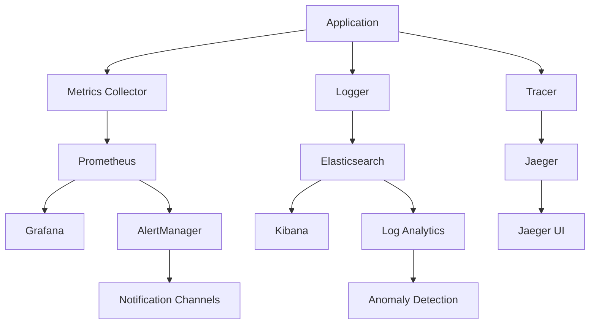

## .kiro/specs/monitoring-observability/design.md
```markdown
# Monitoring & Observability Design
---
priority: 1
---

## Architecture Overview



## Metrics Collection

### Prometheus Metrics Implementation
```python
from prometheus_client import Counter, Histogram, Gauge, Summary, Info
from prometheus_client import CollectorRegistry, generate_latest
import time
from functools import wraps

# Create registry
registry = CollectorRegistry()

# Define metrics
request_count = Counter(
    'api_requests_total',
    'Total API requests',
    ['method', 'endpoint', 'status'],
    registry=registry
)

request_duration = Histogram(
    'api_request_duration_seconds',
    'API request duration',
    ['method', 'endpoint'],
    buckets=[0.01, 0.025, 0.05, 0.1, 0.25, 0.5, 1.0, 2.5, 5.0],
    registry=registry
)

model_inference_time = Summary(
    'model_inference_duration_seconds',
    'Model inference duration',
    ['model_version'],
    registry=registry
)

active_users = Gauge(
    'active_users_total',
    'Number of active users',
    registry=registry
)

model_info = Info(
    'model_metadata',
    'Model metadata',
    registry=registry
)

# Decorator for automatic metrics
def track_metrics(endpoint):
    def decorator(func):
        @wraps(func)
        async def wrapper(*args, **kwargs):
            start_time = time.time()
            status = 200
            
            try:
                result = await func(*args, **kwargs)
                return result
            except Exception as e:
                status = 500
                raise
            finally:
                duration = time.time() - start_time
                request_count.labels(
                    method='POST',
                    endpoint=endpoint,
                    status=status
                ).inc()
                request_duration.labels(
                    method='POST',
                    endpoint=endpoint
                ).observe(duration)
        
        return wrapper
    return decorator

# ML-specific metrics
class MLMetrics:
    """ML-specific metric collection"""
    
    def __init__(self, registry):
        self.prediction_error = Gauge(
            'model_prediction_error',
            'Current prediction error',
            ['metric_type'],
            registry=registry
        )
        
        self.feature_drift = Gauge(
            'feature_drift_score',
            'Feature drift score',
            ['feature_name'],
            registry=registry
        )
        
        self.training_progress = Gauge(
            'training_progress_percent',
            'Training progress',
            ['experiment_id'],
            registry=registry
        )
    
    def update_prediction_error(self, rmse, mae):
        """Update prediction error metrics"""
        self.prediction_error.labels(metric_type='rmse').set(rmse)
        self.prediction_error.labels(metric_type='mae').set(mae)
    
    def update_feature_drift(self, drift_scores):
        """Update feature drift metrics"""
        for feature, score in drift_scores.items():
            self.feature_drift.labels(feature_name=feature).set(score)
```

### Custom Metrics Aggregation
```python
class MetricsAggregator:
    """Aggregates and processes metrics"""
    
    def __init__(self):
        self.metrics_buffer = []
        self.aggregation_window = 60  # seconds
        
    def add_metric(self, metric_name, value, labels=None):
        """Add metric to buffer"""
        self.metrics_buffer.append({
            'name': metric_name,
            'value': value,
            'labels': labels or {},
            'timestamp': time.time()
        })
        
        # Cleanup old metrics
        cutoff = time.time() - self.aggregation_window
        self.metrics_buffer = [
            m for m in self.metrics_buffer 
            if m['timestamp'] > cutoff
        ]
    
    def get_aggregated(self, metric_name, aggregation='mean'):
        """Get aggregated metric value"""
        values = [
            m['value'] for m in self.metrics_buffer
            if m['name'] == metric_name
        ]
        
        if not values:
            return None
        
        if aggregation == 'mean':
            return sum(values) / len(values)
        elif aggregation == 'sum':
            return sum(values)
        elif aggregation == 'max':
            return max(values)
        elif aggregation == 'min':
            return min(values)
        elif aggregation == 'p95':
            return np.percentile(values, 95)
```

## Logging Implementation

### Structured Logging
```python
import structlog
import json
from pythonjsonlogger import jsonlogger

# Configure structured logging
structlog.configure(
    processors=[
        structlog.stdlib.filter_by_level,
        structlog.stdlib.add_logger_name,
        structlog.stdlib.add_log_level,
        structlog.stdlib.PositionalArgumentsFormatter(),
        structlog.processors.TimeStamper(fmt="iso"),
        structlog.processors.StackInfoRenderer(),
        structlog.processors.format_exc_info,
        structlog.processors.UnicodeDecoder(),
        structlog.processors.JSONRenderer()
    ],
    context_class=dict,
    logger_factory=structlog.stdlib.LoggerFactory(),
    cache_logger_on_first_use=True,
)

class ContextualLogger:
    """Logger with automatic context injection"""
    
    def __init__(self, service_name):
        self.logger = structlog.get_logger(service_name)
        self.context = {}
    
    def bind(self, **kwargs):
        """Add context that will be included in all logs"""
        self.context.update(kwargs)
        return self
    
    def log(self, level, message, **kwargs):
        """Log with context"""
        self.logger.log(
            level,
            message,
            **{**self.context, **kwargs}
        )
    
    def info(self, message, **kwargs):
        self.log('info', message, **kwargs)
    
    def error(self, message, exception=None, **kwargs):
        if exception:
            kwargs['exception'] = str(exception)
            kwargs['stack_trace'] = traceback.format_exc()
        self.log('error', message, **kwargs)

# Usage example
logger = ContextualLogger('model-serving')
logger.bind(
    request_id='abc123',
    user_id='user456',
    model_version='v1.0.0'
)
logger.info('Prediction completed', 
    duration_ms=45,
    ticker='AAPL',
    confidence=0.85
)
```

### Log Aggregation Pipeline
```python
class LogAggregator:
    """Aggregates logs for analysis"""
    
    def __init__(self, elasticsearch_host):
        self.es = Elasticsearch([elasticsearch_host])
        self.buffer = []
        self.buffer_size = 100
        
    def add_log(self, log_entry):
        """Add log to buffer"""
        self.buffer.append(log_entry)
        
        if len(self.buffer) >= self.buffer_size:
            self.flush()
    
    def flush(self):
        """Send logs to Elasticsearch"""
        if not self.buffer:
            return
        
        bulk_data = []
        for log in self.buffer:
            bulk_data.append({
                'index': {
                    '_index': f"logs-{log['service']}-{log['timestamp'][:10]}",
                    '_type': '_doc'
                }
            })
            bulk_data.append(log)
        
        self.es.bulk(body=bulk_data)
        self.buffer = []
    
    def search_errors(self, time_range='1h'):
        """Search for recent errors"""
        query = {
            'query': {
                'bool': {
                    'must': [
                        {'term': {'level': 'error'}},
                        {'range': {'timestamp': {'gte': f'now-{time_range}'}}}
                    ]
                }
            }
        }
        
        return self.es.search(index='logs-*', body=query)
```

## Distributed Tracing

### OpenTelemetry Implementation
```python
from opentelemetry import trace
from opentelemetry.exporter.jaeger import JaegerExporter
from opentelemetry.sdk.trace import TracerProvider
from opentelemetry.sdk.trace.export import BatchSpanProcessor
from opentelemetry.instrumentation.fastapi import FastAPIInstrumentor
import contextvars

# Setup tracing
trace.set_tracer_provider(TracerProvider())
tracer = trace.get_tracer(__name__)

# Configure Jaeger exporter
jaeger_exporter = JaegerExporter(
    agent_host_name="localhost",
    agent_port=6831,
)

span_processor = BatchSpanProcessor(jaeger_exporter)
trace.get_tracer_provider().add_span_processor(span_processor)

class TraceContext:
    """Manages trace context across async operations"""
    
    def __init__(self):
        self.trace_id = contextvars.ContextVar('trace_id')
        self.span_stack = contextvars.ContextVar('span_stack', default=[])
    
    def start_span(self, name, attributes=None):
        """Start a new span"""
        span = tracer.start_span(name)
        
        if attributes:
            for key, value in attributes.items():
                span.set_attribute(key, value)
        
        # Add to stack
        stack = self.span_stack.get()
        stack.append(span)
        self.span_stack.set(stack)
        
        return span
    
    def end_span(self):
        """End current span"""
        stack = self.span_stack.get()
        if stack:
            span = stack.pop()
            span.end()
            self.span_stack.set(stack)

# Decorator for tracing
def trace_operation(operation_name):
    def decorator(func):
        @wraps(func)
        async def wrapper(*args, **kwargs):
            with tracer.start_as_current_span(
                operation_name,
                kind=trace.SpanKind.INTERNAL
            ) as span:
                try:
                    # Add function arguments as attributes
                    span.set_attribute("function", func.__name__)
                    
                    result = await func(*args, **kwargs)
                    
                    span.set_status(trace.Status(trace.StatusCode.OK))
                    return result
                    
                except Exception as e:
                    span.set_status(
                        trace.Status(
                            trace.StatusCode.ERROR,
                            str(e)
                        )
                    )
                    span.record_exception(e)
                    raise
        
        return wrapper
    return decorator
```

## Alerting System

### Alert Manager
```python
class AlertManager:
    """Manages alert rules and notifications"""
    
    def __init__(self, config):
        self.rules = self.load_rules(config.rules_path)
        self.notifiers = self.setup_notifiers(config.channels)
        self.alert_state = {}
        
    def evaluate_rules(self, metrics):
        """Evaluate alert rules against metrics"""
        triggered_alerts = []
        
        for rule in self.rules:
            if self.evaluate_condition(rule.condition, metrics):
                alert = Alert(
                    name=rule.name,
                    severity=rule.severity,
                    message=rule.message,
                    labels=rule.labels
                )
                triggered_alerts.append(alert)
        
        return triggered_alerts
    
    def send_alerts(self, alerts):
        """Send alerts through configured channels"""
        for alert in alerts:
            # Check if already alerting
            if alert.fingerprint in self.alert_state:
                if not self.should_repeat(alert):
                    continue
            
            # Route based on severity
            channels = self.get_channels_for_severity(alert.severity)
            
            for channel in channels:
                notifier = self.notifiers[channel]
                notifier.send(alert)
            
            # Update state
            self.alert_state[alert.fingerprint] = {
                'first_seen': time.time(),
                'last_sent': time.time(),
                'count': 1
            }

class SlackNotifier:
    """Slack notification channel"""
    
    def __init__(self, webhook_url):
        self.webhook_url = webhook_url
        
    def send(self, alert):
        """Send alert to Slack"""
        payload = {
            'text': f"🚨 *{alert.severity.upper()}*: {alert.name}",
            'attachments': [{
                'color': self.get_color(alert.severity),
                'fields': [
                    {'title': 'Message', 'value': alert.message},
                    {'title': 'Time', 'value': alert.timestamp},
                    {'title': 'Labels', 'value': str(alert.labels)}
                ]
            }]
        }
        
        requests.post(self.webhook_url, json=payload)
```

## Dashboard Configuration

### Grafana Dashboard JSON
```json
{
  "dashboard": {
    "title": "ML Model Monitoring",
    "panels": [
      {
        "title": "Prediction Latency",
        "type": "graph",
        "targets": [{
          "expr": "histogram_quantile(0.95, rate(api_request_duration_seconds_bucket[5m]))"
        }]
      },
      {
        "title": "Model Accuracy",
        "type": "stat",
        "targets": [{
          "expr": "model_prediction_error{metric_type='rmse'}"
        }]
      },
      {
        "title": "Feature Drift",
        "type": "heatmap",
        "targets": [{
          "expr": "feature_drift_score"
        }]
      }
    ]
  }
}
```
```

