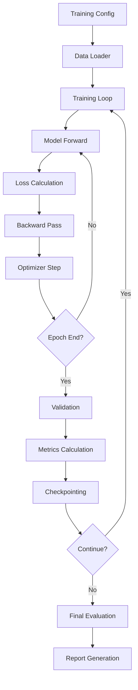

## .kiro/specs/training-pipeline/design.md
```markdown
# Training Pipeline Design
---
priority: 1
---

## Architecture Overview



## Core Components Design

### Training Orchestrator
```python
class TrainingOrchestrator:
    """Manages complete training pipeline"""
    
    def __init__(self, config: TrainingConfig):
        self.config = config
        self.model = self._build_model()
        self.optimizer = self._build_optimizer()
        self.scheduler = self._build_scheduler()
        self.criterion = self._build_criterion()
        self.tracker = ExperimentTracker(config.experiment_name)
        
    def train(self, train_loader, val_loader, test_loader):
        """Main training loop"""
        best_val_loss = float('inf')
        early_stopping = EarlyStopping(patience=10)
        
        for epoch in range(self.config.num_epochs):
            # Training phase
            train_metrics = self.train_epoch(train_loader)
            
            # Validation phase
            val_metrics = self.validate(val_loader)
            
            # Learning rate scheduling
            self.scheduler.step(val_metrics['loss'])
            
            # Checkpointing
            if val_metrics['loss'] < best_val_loss:
                best_val_loss = val_metrics['loss']
                self.save_checkpoint('best_model.pt', epoch, val_metrics)
            
            # Early stopping
            if early_stopping.should_stop(val_metrics['loss']):
                logger.info(f"Early stopping at epoch {epoch}")
                break
            
            # Logging
            self.tracker.log_metrics(train_metrics, val_metrics, epoch)
        
        # Final evaluation
        test_metrics = self.evaluate(test_loader)
        self.generate_report(test_metrics)
```

### Loss Function Design
```python
class CompositeLoss(nn.Module):
    """Multi-objective loss function"""
    
    def __init__(self, config):
        super().__init__()
        self.price_weight = config.price_loss_weight
        self.direction_weight = config.direction_loss_weight
        self.volatility_weight = config.volatility_loss_weight
        self.quantile_weight = config.quantile_loss_weight
        
        self.mse_loss = nn.MSELoss()
        self.ce_loss = nn.CrossEntropyLoss()
        self.quantile_loss = QuantileLoss()
        
    def forward(self, predictions, targets):
        """Calculate composite loss"""
        # Price prediction loss
        price_loss = self.mse_loss(
            predictions['price'], 
            targets['price']
        )
        
        # Direction classification loss
        pred_direction = (predictions['price'][:, 1:] > predictions['price'][:, :-1]).float()
        true_direction = (targets['price'][:, 1:] > targets['price'][:, :-1]).float()
        direction_loss = self.ce_loss(pred_direction, true_direction)
        
        # Volatility prediction loss
        volatility_loss = self.mse_loss(
            predictions['volatility'],
            targets['volatility']
        )
        
        # Quantile regression loss
        q_loss = 0
        for i, q in enumerate([0.1, 0.25, 0.5, 0.75, 0.9]):
            q_loss += self.quantile_loss(
                predictions['quantiles'][:, i],
                targets['price'],
                q
            )
        
        # Combine losses
        total_loss = (
            self.price_weight * price_loss +
            self.direction_weight * direction_loss +
            self.volatility_weight * volatility_loss +
            self.quantile_weight * q_loss
        )
        
        return total_loss, {
            'price_loss': price_loss.item(),
            'direction_loss': direction_loss.item(),
            'volatility_loss': volatility_loss.item(),
            'quantile_loss': q_loss.item(),
            'total_loss': total_loss.item()
        }
```

### Training Loop Implementation
```python
class Trainer:
    """Handles training loop logic"""
    
    def train_epoch(self, data_loader):
        """Single epoch training"""
        self.model.train()
        epoch_losses = []
        epoch_metrics = defaultdict(list)
        
        pbar = tqdm(data_loader, desc="Training")
        for batch_idx, batch in enumerate(pbar):
            # Move to device
            inputs = batch['inputs'].to(self.device)
            targets = batch['targets'].to(self.device)
            
            # Mixed precision training
            with autocast(enabled=self.config.use_amp):
                # Forward pass
                predictions = self.model(inputs)
                
                # Calculate loss
                loss, loss_components = self.criterion(predictions, targets)
                
                # Scale for gradient accumulation
                loss = loss / self.config.gradient_accumulation_steps
            
            # Backward pass
            if self.config.use_amp:
                self.scaler.scale(loss).backward()
            else:
                loss.backward()
            
            # Gradient accumulation
            if (batch_idx + 1) % self.config.gradient_accumulation_steps == 0:
                if self.config.use_amp:
                    self.scaler.unscale_(self.optimizer)
                
                # Gradient clipping
                torch.nn.utils.clip_grad_norm_(
                    self.model.parameters(),
                    self.config.gradient_clip
                )
                
                # Optimizer step
                if self.config.use_amp:
                    self.scaler.step(self.optimizer)
                    self.scaler.update()
                else:
                    self.optimizer.step()
                
                self.optimizer.zero_grad()
            
            # Track metrics
            epoch_losses.append(loss.item())
            for k, v in loss_components.items():
                epoch_metrics[k].append(v)
            
            # Update progress bar
            pbar.set_postfix({
                'loss': np.mean(epoch_losses[-100:]),
                'lr': self.optimizer.param_groups[0]['lr']
            })
        
        return {
            'loss': np.mean(epoch_losses),
            **{k: np.mean(v) for k, v in epoch_metrics.items()}
        }
```

### Validation and Evaluation
```python
class Evaluator:
    """Handles model evaluation"""
    
    @torch.no_grad()
    def validate(self, model, data_loader):
        """Validation loop"""
        model.eval()
        predictions = []
        actuals = []
        losses = []
        
        for batch in tqdm(data_loader, desc="Validating"):
            inputs = batch['inputs'].to(self.device)
            targets = batch['targets'].to(self.device)
            
            # Forward pass
            outputs = model(inputs)
            
            # Calculate loss
            loss, _ = self.criterion(outputs, targets)
            losses.append(loss.item())
            
            # Store predictions
            predictions.append(outputs['price'].cpu())
            actuals.append(targets['price'].cpu())
        
        # Concatenate predictions
        predictions = torch.cat(predictions)
        actuals = torch.cat(actuals)
        
        # Calculate metrics
        metrics = self.calculate_metrics(predictions, actuals)
        metrics['loss'] = np.mean(losses)
        
        return metrics
    
    def calculate_metrics(self, predictions, actuals):
        """Calculate evaluation metrics"""
        # Convert to numpy
        pred_np = predictions.numpy()
        actual_np = actuals.numpy()
        
        # Regression metrics
        rmse = np.sqrt(mean_squared_error(actual_np, pred_np))
        mae = mean_absolute_error(actual_np, pred_np)
        
        # Directional accuracy
        pred_direction = np.diff(pred_np, axis=1) > 0
        actual_direction = np.diff(actual_np, axis=1) > 0
        directional_accuracy = (pred_direction == actual_direction).mean()
        
        # Financial metrics
        returns = self.calculate_returns(pred_np, actual_np)
        sharpe_ratio = self.calculate_sharpe(returns)
        max_drawdown = self.calculate_max_drawdown(returns)
        
        return {
            'rmse': rmse,
            'mae': mae,
            'directional_accuracy': directional_accuracy,
            'sharpe_ratio': sharpe_ratio,
            'max_drawdown': max_drawdown
        }
```

### Experiment Tracking Integration
```python
class ExperimentTracker:
    """Tracks experiments with W&B and MLflow"""
    
    def __init__(self, experiment_name):
        # Initialize W&B
        self.wandb_run = wandb.init(
            project="timeseries-transformer",
            name=experiment_name,
            config=config
        )
        
        # Initialize MLflow
        mlflow.set_experiment(experiment_name)
        mlflow.start_run()
        
        # TensorBoard
        self.tb_writer = SummaryWriter(f"runs/{experiment_name}")
    
    def log_metrics(self, train_metrics, val_metrics, epoch):
        """Log metrics to all trackers"""
        # Weights & Biases
        wandb.log({
            **{f"train/{k}": v for k, v in train_metrics.items()},
            **{f"val/{k}": v for k, v in val_metrics.items()},
            "epoch": epoch
        })
        
        # MLflow
        for k, v in train_metrics.items():
            mlflow.log_metric(f"train_{k}", v, step=epoch)
        for k, v in val_metrics.items():
            mlflow.log_metric(f"val_{k}", v, step=epoch)
        
        # TensorBoard
        for k, v in train_metrics.items():
            self.tb_writer.add_scalar(f"train/{k}", v, epoch)
        for k, v in val_metrics.items():
            self.tb_writer.add_scalar(f"val/{k}", v, epoch)
    
    def log_model(self, model_path):
        """Log model artifact"""
        wandb.save(model_path)
        mlflow.log_artifact(model_path)
```

### Hyperparameter Optimization
```python
class HyperparameterOptimizer:
    """Automated hyperparameter search"""
    
    def __init__(self, config_space):
        self.config_space = config_space
        self.study = optuna.create_study(
            direction="minimize",
            pruner=optuna.pruners.MedianPruner()
        )
    
    def objective(self, trial):
        """Optuna objective function"""
        # Sample hyperparameters
        config = {
            'learning_rate': trial.suggest_loguniform('lr', 1e-5, 1e-3),
            'batch_size': trial.suggest_categorical('batch_size', [16, 32, 64]),
            'num_layers': trial.suggest_int('num_layers', 4, 8),
            'hidden_dim': trial.suggest_categorical('hidden_dim', [128, 256, 512]),
            'dropout': trial.suggest_uniform('dropout', 0.1, 0.3),
            'num_heads': trial.suggest_categorical('num_heads', [4, 8, 16])
        }
        
        # Train model with config
        trainer = Trainer(config)
        val_loss = trainer.train(
            train_loader,
            val_loader,
            trial=trial  # For pruning
        )
        
        return val_loss
    
    def optimize(self, n_trials=50):
        """Run optimization"""
        self.study.optimize(self.objective, n_trials=n_trials)
        
        # Return best config
        return self.study.best_params
```
```

